= pentomino

a pentomino is a polyomino of order 5, that is, a polygon in the plane made of 5 equal-sized squares connected edge-to-edge.

== Plane

平面

=== Rectangle

長方形

==== rectangle_3x20

* results
+
[cols="2*", options="header"]
|===
| total | uniq
| 8     | 2
|===

* output
+
link:./plane_rectangle_3x20.txt[plane_rectangle_3x20.txt]

* example
+
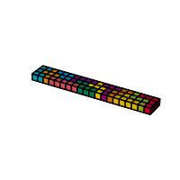

==== rectangle_4x15

* results
+
[cols="2*", options="header"]
|===
| total | uniq
| 1472  | 368
|===

* output
+
link:./plane_rectangle_4x15.txt[plane_rectangle_4x15.txt]

* example
+
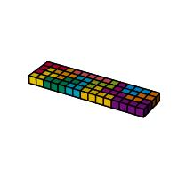

==== rectangle_5x12

* results
+
[cols="2*", options="header"]
|===
| total | uniq
| 4040  | 1010
|===

* output
+
link:./plane_rectangle_5x12.txt[plane_rectangle_5x12.txt]

* example
+
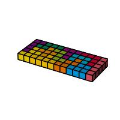

==== rectangle_6x10

* results
+
[cols="2*", options="header"]
|===
| total | uniq
| 9356  | 2339
|===

* output
+
link:./plane_rectangle_6x10.txt[plane_rectangle_6x10.txt]

* example
+
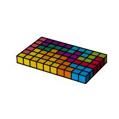

=== Square

正方形

==== square_8x8

* results
+
[cols="2*", options="header"]
|===
| total | uniq
| 520   | 65
|===

* output
+
link:./plane_square_8x8.txt[plane_square_8x8.txt]

* example
+
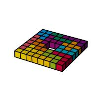

== Solid

立体

=== Rectangular

直方体

==== rectangular_2x3x10

* results
+
[cols="2*", options="header"]
|===
| total | uniq
| 96    | 12
|===

* output
+
link:./solid_rectangular_2x3x10.txt[solid_rectangular_2x3x10.txt]

* example
+
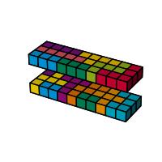

==== rectangular 2x5x6

* results
+
[cols="2*", options="header"]
|===
| total | uniq
| 2112  | 264
|===

* output
+
link:./solid_rectangular_2x5x6.txt[solid_rectangular_2x5x6.txt]

* example
+
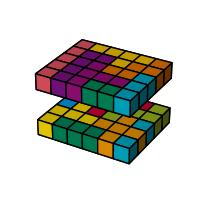

==== rectangular 3x4x5

* results
+
[cols="2*", options="header"]
|===
| total | uniq
| 31520 | 3940
|===

* output
+
link:./solid_rectangular_3x4x5.txt[solid_rectangular_3x4x5.txt]

* example
+
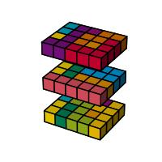

=== Hollow

ロの字型

==== hollow_3x3x9

* results
+
[cols="2*", options="header"]
|===
| total | uniq
| 24    | 3
|===

* output
+
link:./solid_hollow_3x3x9.txt[solid_hollow_3x3x9.txt]

* example
+
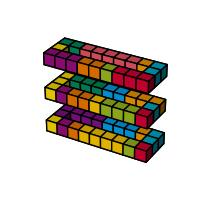

==== hollow_3x5x7

* results
+
[cols="2*", options="header"]
|===
| total | uniq
| 8     | 1
|===

* output
+
link:./solid_hollow_3x5x7.txt[solid_hollow_3x5x7.txt]

* example
+
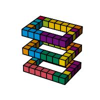

==== hollow 5x3x5

* results
+
[cols="2*", options="header"]
|===
| total | uniq
| 1488  | 186
|===

* output
+
link:./solid_hollow_5x3x5.txt[solid_hollow_5x3x5.txt]

* example
+
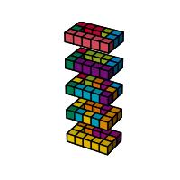

=== Stairs

階段型
